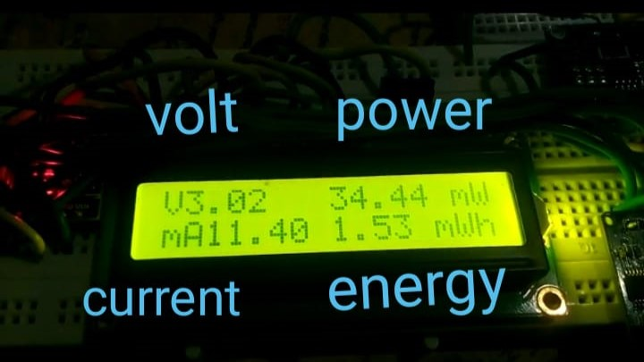
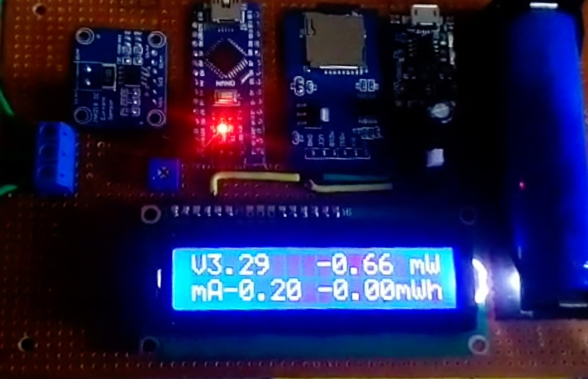
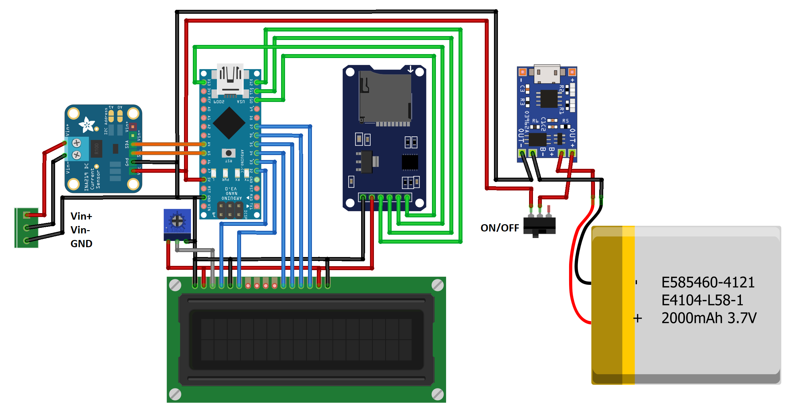

# Powr_Log (Power_Logger)

Powr_Log is an Arduino-based power monitoring project that utilizes the INA219 current sensor, a 16x2 LCD, and an SD card module. This project allows you to measure, display, and log real-time current, voltage, and energy consumption of connected loads, making it ideal for tracking power usage in various electronic applications.

## Features

- Accurate and precise current, voltage, and power measurement with the INA219 sensor.
- Real-time display of current (in mA), voltage (in V), and power (in mW) on the 16x2 LCD.
- Energy consumption logging to an SD card in "TIME.txt", "VOLT.txt", and "CUR.txt" files.
- Flexible and customizable for different load types and power ranges.
- Easy-to-use Arduino code for quick setup and integration into your projects.

## Hardware Requirements

- Arduino board (e.g., Arduino Uno, Arduino Nano).
- INA219 current sensor breakout board.
- 16x2 LCD display (compatible with the Hitachi HD44780 driver).
- SD card module (SPI communication).
- Current shunt resistor appropriate for your application.
- Power supply and load to be measured.

## Software Requirements

- Arduino IDE (https://www.arduino.cc/en/software) with the required libraries:
  - Wire library (pre-installed with the Arduino IDE).
  - Adafruit_INA219 library (https://github.com/adafruit/Adafruit_INA219).
  - LiquidCrystal library (pre-installed with the Arduino IDE).
  - SdFat library (https://github.com/greiman/SdFat).

## Setup Instructions

1. Connect the hardware components as per the circuit diagram in the "Powr_Log_Sch.png" file.

2. Install the required libraries in your Arduino IDE using "Sketch" > "Include Library" > "Manage Libraries."

3. Upload the "powr_log.ino" sketch to your Arduino board.

4. Ensure your SD card is correctly formatted (FAT16/FAT32).

5. Insert the SD card into the SD card module.

6. Power on the system and observe the current, voltage, and power readings on the LCD.

## Circuit Schematic

## Usage

- The LCD will display the current (in mA), voltage (in V), and power (in mW) readings.

- The system will log the timestamp, voltage, and current readings in the "TIME.txt," "VOLT.txt," and "CUR.txt" files on the SD card, respectively.

- Use this Power Logger in your electronic projects to monitor power consumption and analyze energy usage patterns.

## Contributing

Contributions to the Powr_Log project are welcome! If you find bugs or want to add new features, please submit an issue or pull request.

## Acknowledgments

Special thanks to the developers of the Adafruit_INA219 and SdFat libraries for their valuable contributions.

This project was inspired by the "Make Your Own Power Meter/Logger" instructable by GreatScott. You can find the original instructable here: [Make Your Own Power Meter/Logger](https://www.instructables.com/Make-Your-Own-Power-MeterLogger/). GreatScott's instructable provided the foundation and inspiration for this Power Logger, and we appreciate the educational content provided in the instructable.

## Disclaimer

This project is provided as-is and without warranty. The authors are not liable for any damages or losses arising from the use of this project.
